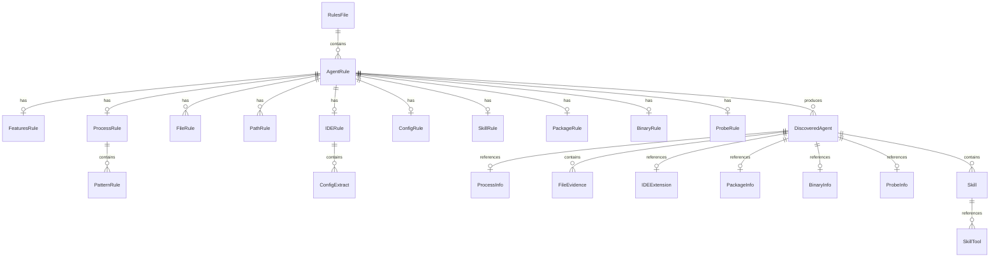
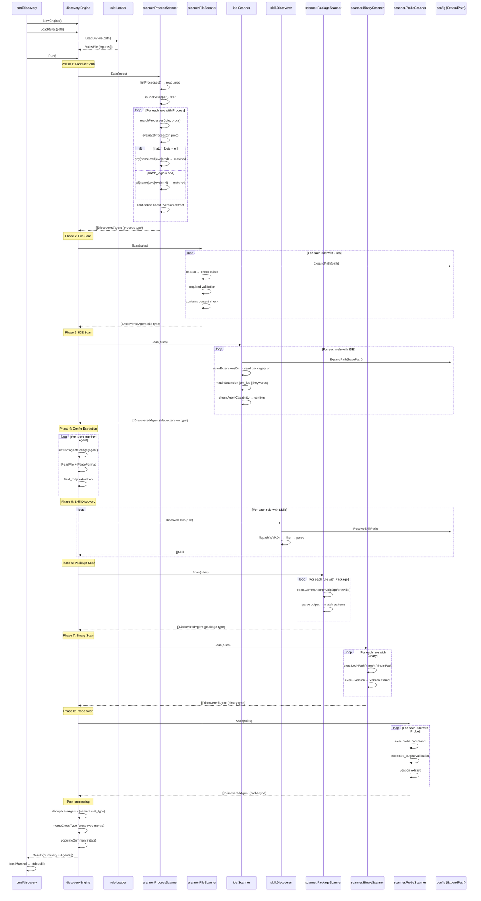
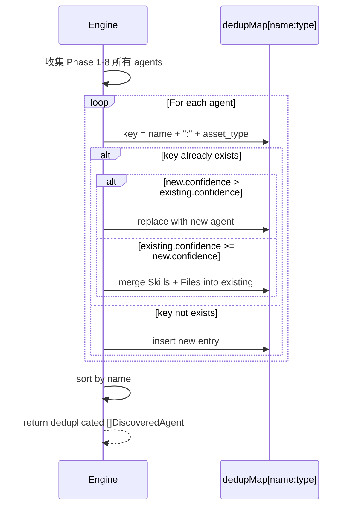
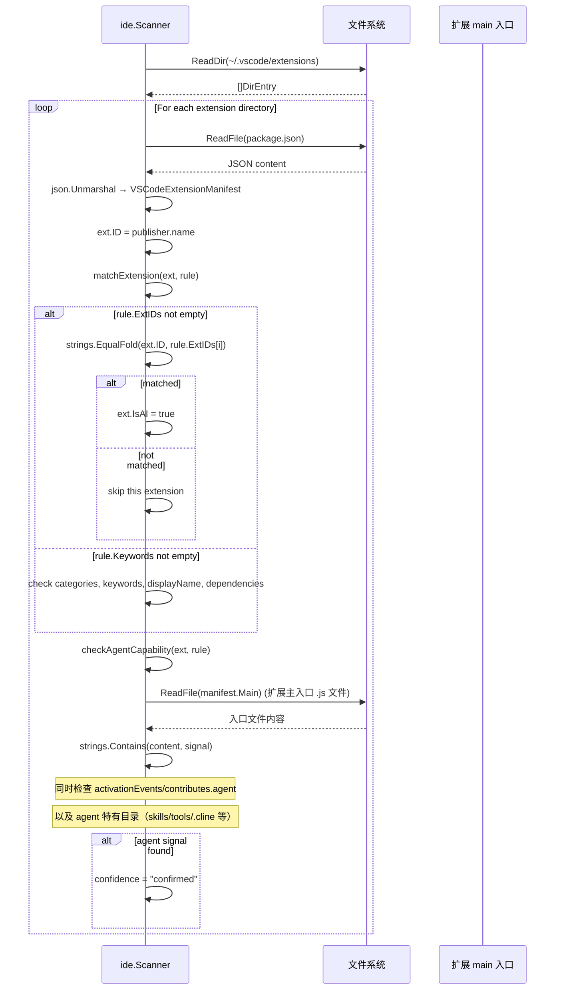

# 项目架构与流程文档

本文档描述 AI Asset Discovery 的项目架构、扫描流程和时序图。

---

## 目录

1. [整体架构](#整体架构)
2. [模块职责](#模块职责)
3. [数据模型](#数据模型)
4. [扫描流程](#扫描流程)
5. [时序图](#时序图)
6. [扩展点](#扩展点)

---

## 整体架构

```
┌─────────────────────────────────────────────────┐
│                   cmd/discovery                  │
│              CLI 入口（flag 解析 + JSON 输出）      │
└─────────────────────┬───────────────────────────┘
                      │
┌─────────────────────▼───────────────────────────┐
│             internal/discovery/Engine            │
│   编排器：加载规则 → 多阶段扫描 → 去重 → 输出汇总    │
┌──┬────────┬──────────┬───────────┬──────────────┬──────────────┐
   │        │          │           │              │
   ▼        ▼          ▼           ▼              ▼
┌──────┐ ┌──────┐ ┌──────┐ ┌──────┐ ┌──────┐ ┌──────┐ ┌───────────┐
│Process│ │File  │ │ IDE  │ │Pkg   │ │Binary│ │Probe │ │  Skill    │
│Scanner│ │Scanner│ │Scanner│ │Scanner│ │Scanner│ │Scanner│ │Discoverer │
└──┬───┘ └──┬───┘ └──┬───┘ └──┬───┘ └──┬───┘ └──┬───┘ └─────┬─────┘
   │        │         │        │         │        │          │
   ▼        ▼         ▼        ▼         ▼        ▼          ▼
 /proc   文件系统  IDE扩展目录 npm/pip/apt  $PATH  exec探测  技能目录
```

### 分层架构

```
                    ┌──────────┐
                    │ main.go  │  CLI 层
                    └────┬─────┘
                         │
              ┌──────────▼──────────┐
              │   discovery.Engine  │  编排层
              └──┬────┬────┬────┬──┘
                 │    │    │    │
    ┌────────────▼──┐ │    │    │
    │ scanner/      │ │    │    │  扫描层
    │ process.go    ├─┘    │    │
    │ filesystem.go ├──────┘    │
    │ package.go    ├───────────┘
    │ binary.go     │
    │ probe.go      │
    └───────────────┘
    ┌───────────────────────────▼──┐
    │ ide/scanner.go               │
    └──────────────────────────────┘
    ┌───────────────────────────▼──┐
    │ skill/discoverer.go          │
    └──────────────────────────────┘
                 │
    ┌────────────▼──────────────┐
    │ model/                    │  数据层
    │ rule.go  types.go         │
    └───────────────────────────┘
    ┌────────────▼──────────────┐
    │ rule/loader.go            │  配置层
    │ config/config.go          │
    │ platform/paths.go         │
    └───────────────────────────┘
```

---

## 模块职责

### `cmd/discovery/main.go`
- **职责**：CLI 入口
- **输入**：命令行参数（`-rules`, `-output`, `-pretty`）
- **输出**：JSON 到 stdout 或文件
- **流程**：`NewEngine()` → `LoadRules()` → `Run()` → `json.Marshal()` → 输出

### `internal/discovery/engine.go`
- **职责**：扫描编排器
- **核心方法**：
  - `LoadRules(path)` — 从文件/目录加载 YAML 规则
  - `Run()` — 执行 8 阶段扫描流水线 + 后处理（去重合并）
  - `populateSummary()` — 生成统计摘要
  - `deduplicateAgents()` — 按 name + asset_type 去重合并
  - `mergeCrossType()` — 跨 asset_type 合并同 name 的多条证据
  - `LoadRulesFromBytes(data)` — 直接从 YAML 字节加载规则
- **依赖**：所有 Scanner、Loader、Discoverer

### `internal/scanner/process.go`（+ `process_linux.go` / `process_darwin.go` / `process_windows.go`）
- **职责**：跨平台进程扫描
- **Linux**：遍历 `/proc/[0-9]+/` 目录，读取 comm / cmdline / exe / cwd / status（进程名截断 15 字符）
- **macOS**：执行 `ps -eo pid,ppid,user,comm,args` 解析进程列表（进程名截断 20 字符，无 cwd/exe）
- **Windows**：通过 Windows API 枚举进程
- **核心逻辑**：
  - `listProcesses()` — 平台特定实现，返回进程列表
  - `evaluateProcess(rule, proc)` — 按 name_patterns / cmd_patterns / exe_patterns / dir_patterns 顺序匹配
  - `isShellWrapper()` — 过滤自身的父 Shell
- **匹配算法**：`or`（任一字段命中）| `and`（所有已配置字段命中）

### `internal/scanner/filesystem.go`
- **职责**：扫描文件系统证据
- **核心逻辑**：
  - `matchFiles(rule)` — 逐个 FileRule 检查路径是否存在
  - `checkFileContent(path, contains)` — 读取前 10KB 做子串匹配
  - `walkDir(root, maxDepth)` — 目录遍历
- **必需/可选逻辑**：有 `required: true` 则必须命中至少一个，否则规则无输出

### `internal/scanner/package.go`
- **职责**：通过包管理器（npm、pip、apt、brew、cargo、gem）检测已安装的 AI 软件包
- **核心逻辑**：
  - `scanPackageRule(rule)` — 对每条规则的 managers 列表，调用相应包管理器的 list 命令
  - `listPackages(mgr)` — 执行 `npm list -g` / `pip list` / `apt list --installed` 等
  - `matchPackage(name, patterns)` — 支持 exact 和 regex 匹配
- **支持的包管理器**：npm、pip/pip3、apt、brew、cargo、gem

### `internal/scanner/binary.go`
- **职责**：通过 `$PATH` 扫描已安装的 CLI 二进制程序
- **核心逻辑**：
  - `scanBinaryRule(rule)` — `exec.LookPath(name)` 查找二进制
  - `getVersion(path, flag, regex)` — 执行 `binary --version` 并正则提取版本号
  - `findInPath(pp)` — 对 regex 模式，遍历 PATH 目录进行文件名匹配
- **版本提取**：通过 `version_flag`（如 `--version`、`-V`）获取输出，再用 `version_regex` 提取

### `internal/scanner/probe.go`
- **职责**：通过执行命令探测 Agent 类型并提取版本
- **核心逻辑**：
  - `probeRule(rule)` — `exec.LookPath` 查找命令 → 执行 → 可选 ExpectedOutput 验证
  - `extractProbeVersion(output, regex)` — 正则提取版本号
- **输出截断**：命令输出截断至 500 字符

### `internal/platform/paths.go`
- **职责**：平台感知的运行时路径工具函数
- **核心函数**：
  - `CurrentOS()` — 返回当前操作系统标识（`linux`、`darwin`、`windows`）
  - `AppConfigDir(appName)` — 返回平台标准的应用配置目录（Linux: `~/.config/`，macOS: `~/Library/Application Support/`，Windows: `%APPDATA%`）
  - `AppHomeDir(appName)` — 返回平台标准的应用 home 目录（所有平台: `~/.<appName>`）
- **注意**：所有 IDE 扩展路径发现已迁移到 YAML 规则中的 `ide.scan_paths` 字段，不再由 Go 代码硬编码

### `internal/ide/scanner.go`
- **职责**：扫描 VS Code / Cursor 等 IDE 的扩展目录
- **核心逻辑**：
  - `scanExtensionsDir(path)` — 遍历扩展目录，读取每个 `package.json`
  - `matchExtension(ext, rule)` — 分层匹配：ext_ids 优先 → keywords 回退
  - `checkAgentCapability(ext, rule)` — 检测 agent_signals
- **匹配优先级**：exact ID > keywords > dependencies

### `internal/skill/discoverer.go`
- **职责**：发现和解析 Agent 技能文件（仅限 SKILL.md）
- **核心逻辑**：
  - `DiscoverSkillsWithProbe(rule, fileDirs)` — 两阶段扫描：先扫显式 scan_paths，再根据 auto_discover 探测定向子目录
  - `ProbeSkillDirs(fileDirs)` — 在文件证据目录下探测 skills/agents/tools/instructions/prompts 等子目录
  - `scanPath(root, rule)` — `filepath.WalkDir` 遍历，按文件名（仅 SKILL.md）和大小/深度过滤
  - `parseSkillFile(path)` — 解析 SKILL.md 文件（YAML frontmatter + Markdown）
- **auto_discover 行为**：当规则设置 `auto_discover: true` 时，引擎会自动在 Agent 的文件证据目录（如 `~/.cline`）下探测 `skills`、`agents`、`tools`、`instructions`、`prompts` 等子目录，无需在 `scan_paths` 中逐一列举

### `internal/rule/loader.go`
- **职责**：加载和解析 YAML 规则文件
- **核心方法**：
  - `LoadFile(path)` — 单文件加载
  - `LoadDir(dir)` — 目录内所有 `.yaml`/`.yml` 合并
  - `Parse(data)` — YAML 反序列化 + 设置默认值
- **规则标准化**：
  - `normalizeFeatures(rule)` — 将简化语法 `features`（`processes`/`packages`/`binaries`/`extensions`/`agent_signals`）自动转换为 legacy 详细字段（`process`/`package`/`binary`/`ide`）
  - `normalizePaths(rule)` — 将简化语法 `paths` 转换为 legacy `files` 规则
- **默认值注入**：`min_confidence` → `possible`；`match_logic` → `or`；`max_depth` → `3`；`max_size_kb` → `100`；`skills.auto_discover` → `true`

### `internal/config/config.go`
- **职责**：跨平台路径解析和 OS 判断
- **核心函数**：
  - `ExpandPath(path)` — `~`、`%VAR%` 展开 + `filepath.Clean`
  - `ResolveSkillPaths(paths)` — 批量解析技能扫描路径
  - `OSName()` / `IsLinux()` / `IsDarwin()` / `IsWindows()` — 运行时 OS 判断

### `internal/model/rule.go` & `types.go`
- **职责**：全部数据结构定义
- **核心类型**：
  - `AgentRule` — 单条检测规则（含 Features / Paths / Probe 简化字段 + Process / Files / IDE / Config / Skills / Package / Binary 详细字段）
  - `FeaturesRule` — 简化检测指纹（processes / packages / binaries / extensions / agent_signals）
  - `ProbeRule` — 命令探测规则（command + args + version_regex + expected_output）
  - `PathRule` — 简化路径规则
  - `ProcessRule` — 进程检测规则
  - `PatternRule` — 模式匹配单元（exact/contains/regex + weight）
  - `FileRule` — 文件证据规则
  - `IDERule` — IDE 扩展规则
  - `ConfigRule` — 配置提取规则
  - `SkillRule` — 技能发现规则
  - `PackageRule` / `PackagePattern` — 包管理器检测规则
  - `BinaryRule` — 二进制 PATH 检测规则
  - `DiscoveredAgent` — 最终检测结果
  - `ProcessInfo` — 进程快照
  - `IDEExtension` — 扩展信息
  - `PackageInfo` / `BinaryInfo` / `ProbeInfo` — 包/二进制/探测结果
  - `Skill` / `SkillTool` — 技能信息

---

## 数据模型

### 核心实体关系



### 扫描结果层级

```
Result
├── Summary
│   ├── total_agents
│   ├── confirmed_agents / possible_agents / ghost_agents
│   ├── total_skills
│   └── by_type: { process: N, ide_extension: M, file: K, package: P, binary: B, probe: R }
└── Agents[]
    ├── name, display_name, version
    ├── confidence (confirmed | possible | ghost)
    ├── asset_type (process | file | ide_extension | config | package | binary | probe)
    ├── Process? (PID, name, cmdline, cwd, executable, ppid, user)
    ├── Files[]? (path, rule_source, match_type, content)
    ├── Extension? (id, name, version, publisher, is_ai, has_agent, ext_path, agent_signals[])
    ├── Package? (name, version, manager, scope)
    ├── Binary? (name, path, version)
    ├── Probe? (command, output, matched)
    ├── Config? (model, api_key, ...)
    ├── Skills[] (name, description, tools[], parameters{}, prompt_template, file_path, format)
    ├── SkillDir?
    └── Metadata?
```

---

## 扫描流程

### 八阶段扫描流水线

```
┌──────────────┐
│ 1. 加载规则   │  LoadRules(path) → Parse YAML → normalizeFeatures → 注入默认值
└──────┬───────┘
       │
┌──────▼───────┐
│ 2. 进程扫描   │  listProcesses() → 过滤自进程 →
│              │  对每条规则 evaluateProcess() → 匹配模式 →
│              │  置信度计算 → 版本提取
└──────┬───────┘
       │
┌──────▼───────┐
│ 3. 文件扫描   │  对每条规则 matchFiles() →
│              │  ExpandPath → 检查存在性 → required 校验 →
│              │  contains 内容检查 → max_depth 目录递归
└──────┬───────┘
       │
┌──────▼───────┐
│ 4. IDE 扫描  │  对每条规则 scanIDERule() →
│              │  按 rule.scan_paths 遍历扩展目录 → 读取 package.json →
│              │  ext_ids 匹配 → keywords 匹配 → agent_signals 检测
└──────┬───────┘
       │
┌──────▼───────┐
│ 5. 版本补全   │  将 Extension.Version 复制到 Agent.Version
└──────┬───────┘
       │
┌──────▼───────┐
│ 6. 配置提取   │  extractAgentConfigs() →
│              │  读取配置文件 → 按 format 解析 → field_map 提取
└──────┬───────┘
       │
┌──────▼───────┐
│ 7. 技能发现   │  discoverSkillsWithProbe() →
│              │  Phase 1: 显式 scan_paths 扫描 →
│              │  Phase 2: auto_discover 探测定向子目录
└──────┬───────┘
       │
┌────────────────────────────────────────────────┐
│ 8. 包管理器扫描  │  npm list / pip list / apt list →
│                  │  匹配 package name patterns → 版本提取
└──────┬───────────┘
       │
┌──────▼───────────┐
│ 9. 二进制扫描     │  which <name> → --version → 版本提取
└──────┬───────────┘
       │
┌──────▼───────────┐
│ 10. 命令探测     │  probe command → expected_output 验证 →
│                  │  版本提取
└──────┬───────────┘
       │
┌──────▼───────────────────────────┐
│ 后处理：去重 + 跨类型合并 + 汇总    │
│ deduplicateAgents → mergeCrossType │
│ → populateSummary                  │
└──────────────────────────────────┘
```

### 进程匹配详细流程

```
输入: AgentRule[], /proc 进程列表
     │
     ▼
┌─────────────────────┐
│ listProcesses()     │  遍历 /proc/[0-9]+/
│   ├─ readProc(pid)  │  读取 comm, cmdline, exe, cwd, status
│   └─ 返回 []ProcessInfo
└────────┬────────────┘
         │
         ▼
┌─────────────────────┐
│ 过滤自进程           │  skip self PID
│ 过滤Shell包装器      │  bash/sh/dash + cmdline 含 "/discovery"
└────────┬────────────┘
         │
         ▼
┌────────────────────────────┐
│ 对每条规则 matchProcesses() │
│   对每个进程 evaluateProcess()
│     ├─ name_patterns 匹配   │
│     ├─ cmd_patterns 匹配    │
│     ├─ exe_patterns 匹配    │
│     └─ dir_patterns 匹配    │
│                              │
│   match_logic = "or"        │
│     → 任一命中 → 匹配成功    │
│   match_logic = "and"       │
│     → 全部命中 → 匹配成功    │
│   未配置的字段视为通过        │
│                              │
│   置信度提升：                │
│     ≥2 字段命中 + ghost     │
│        → possible            │
│     ≥2 字段命中 + 非 ghost  │
│        → confirmed           │
│   版本提取：version_regex    │
│    优先 cmdline，其次 exe    │
└────────────────────────────┘
```

### IDE 扩展匹配详细流程

```
输入: IDERule, 扩展目录列表
     │
     ▼
┌─────────────────────────────┐
│ scanExtensionsDir(dir)       │
│   遍历子目录                  │
│   读取 package.json           │
│   解析 VSCodeExtensionManifest│
│   构造 IDEExtension           │
└────────┬────────────────────┘
         │
         ▼
┌─────────────────────────────┐
│ matchExtension(ext, rule)    │
│                              │
│ ext_ids 不为空？              │
│   ├─ YES → 精确匹配 ext_ids  │  ← 优先级最高
│   │   命中 → isAI=true       │
│   │   未命中 → return false  │
│   │                          │
│   └─ NO → 启发式匹配         │
│        ├─ keywords in categories│
│        ├─ keywords in keywords  │
│        ├─ keywords in displayName│
│        └─ depends in dependencies│
└────────┬────────────────────┘
         │ 命中
         ▼
┌─────────────────────────────┐
│ checkAgentCapability(ext, rule)│
│   读取 package.json 清单      │
│   检查 activationEvents       │
│   检查 contributes.agent      │
│   检查 manifest.Main 路径     │
│   检查 agent 特有目录         │
│   读取扩展入口 .js 文件       │
│   搜索 agent_signals 字符串   │
│   命中 → confidence=confirmed │
└─────────────────────────────┘
```

---

## 时序图

### 完整扫描时序



### 去重与合并时序



### IDE Agent 信号检测时序



---

## 扩展点

### 添加新 Agent 规则

1. 在 `rules/agents.yaml` 中添加新的 `- name: ...` 条目
2. 参考 [规则编写指南](./rule-guide.md) 编写规则
3. 运行 `./discovery --rules rules/` 验证

### 添加新的扫描器

1. 在 `internal/scanner/` 或新建包中创建扫描器 struct
2. 在 `internal/discovery/engine.go` 的 `NewEngine()` 中初始化新扫描器
3. 在 `Run()` 中按所需阶段调用新扫描器的 `Scan()` 方法
4. 在 `internal/model/rule.go` 中添加新的规则类型（如需要）
5. 更新 `internal/model/types.go` 中的 `AssetType` 常量

### 添加新的配置格式支持

1. 在 `internal/discovery/engine.go` 的 `parseConfigFormat()` 中添加新 case
2. 实现对应的解析函数

### 添加新的技能文件格式

技能发现目前仅支持 [Agent Skills 规范](https://agentskills.io/specification) 的 `SKILL.md` 格式（含 YAML frontmatter 的 Markdown 文件）。如需添加新格式支持：

1. 在 `internal/skill/discoverer.go` 的 `scanPath()` 中添加新的文件名匹配逻辑（当前仅匹配 `SKILL.md`）
2. 在 `parseSkillFile()` 中实现新格式的解析分支
3. 更新 `internal/model/types.go` 中 `Skill` 结构体（如需要新字段）

### 添加新的包管理器支持

1. 在 `internal/scanner/package.go` 的 `knownManagers` map 中添加新的管理器配置
2. 实现对应的 `parse*List()` 解析函数
3. 更新 `model.PackageRule` 的 `Managers` 默认列表（`internal/rule/loader.go` 的 `normalizeFeatures`）

### 添加新的匹配类型

1. 在 `internal/scanner/process.go` 的 `matchPattern()` 中添加新 case
2. 在 `internal/model/rule.go` 的 PatternRule 文档中说明新类型
